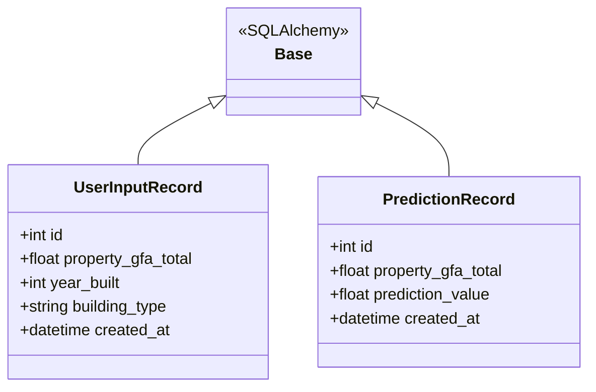
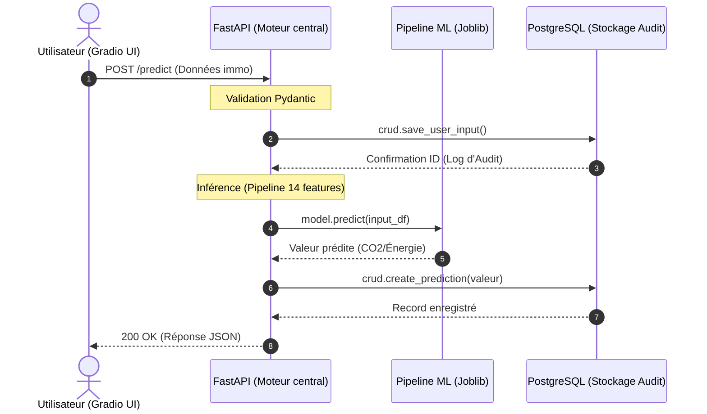

## Déploiement du Modèle ML de Prédiction Carbone (POC) Futurisys:

Bienvenue dans le dépôt du Proof of Concept (POC) de Futurisys. 
Ce projet expose un modèle de Machine Learning via une API robuste, permettant de prédire l'empreinte carbone des bâtiments en fonction de leurs caractéristiques.

### Architecture du Système
Le projet repose sur une architecture moderne de type "API-First" garantissant la traçabilité et la performance.

-Interface Utilisateur (Gradio) : Saisie intuitive des caractéristiques du bâtiment.

-API REST (FastAPI) : Moteur central gérant la validation (Pydantic), l'exécution du modèle et la persistance.

-Base de Données (PostgreSQL) : Archivage systématique de chaque donnée utilisateur , de la prédiction pour audit et ré-entraînement.

-Pipeline CI/CD (GitHub Actions) : Automatisation des tests unitaires et du déploiement vers Hugging Face Spaces.

### Diagramme des classes (structure et données)



### Diagramme de Séquence (Flux de Prédiction)
Ce diagramme illustre le parcours d'une donnée, de la saisie utilisateur jusqu'à l'archivage sécurisé en base de données.



### Justifications Techniques
-FastAPI : Choisi pour sa rapidité d'exécution et sa gestion automatique de la documentation (Swagger). La validation de type via Pydantic assure qu'aucune donnée malformée n'atteint le modèle.

-PostgreSQL & SQLAlchemy : L'utilisation d'un ORM permet une gestion rigoureuse de la base de données, assurant une traçabilité complète (Inputs/Outputs), indispensable pour les futurs audits de conformité carbone.

-Pytest-cov : La fiabilité est garantie par une suite de tests unitaires avec un objectif de couverture > 80%, minimisant les régressions lors des mises à jour.

### Installation et Configuration
Prérequis

Python 3.9+

PostgreSQL (ou Docker)

Installation locale

``` bash
git clone https://github.com/votre-repo/futurisys-ml-api.git
cd futurisys-ml-api 
```

Créer l'environnement virtuel :

```Bash
# creation de l'environnemt virtuel
python -m venv <NOM_DE_L'ENVIRONNEMENT_VIRTUEL>

#lancement de l'environnement virtuel 
source venv/bin/activate # MacOS
venv\Scripts\activate  # Windows: 

# installation des bibliotèques python 
pip install -r requirements.txt
```

Lancer les services :
`
API:  

```bash
uvicorn app.main:app --reload
```

UI:

```bash
python app/ui.py
```

## Documentation de l'API
Une fois l'API lancée, la documentation interactive est accessible sur :

Swagger UI : http://127.0.0.1:8000/docs

ReDoc : http://127.0.0.1:8000/redoc

Exemple de requête (CURL) :

```bash
curl -X 'POST' \
  'http://127.0.0.1:8000/predict' \
  -H 'Content-Type: application/json' \
  -d '{
  "property_gfa_total": 2500,
  "year_built": 2010,
  "building_type": "Office"
}'
```

Protocole de Maintenance
Pour garantir la pertinence des prédictions dans le temps, le protocole suivant est établi :

Surveillance (Monitoring) : Vérification hebdomadaire des logs de l'API pour identifier d'éventuels écarts de distribution des données (Data Drift).

Ré-entraînement : Le modèle est ré-entraîné trimestriellement en utilisant les données collectées dans la base PostgreSQL, enrichies des valeurs réelles de consommation collectées sur le terrain.

Versioning : Chaque version du modèle est taguée via Git (ex: v1.0.1). Toute mise à jour doit passer par le pipeline CI/CD et valider 100% des tests unitaires.

Tests et Qualité
Lancer la suite de tests et générer le rapport de couverture :

```Bash
python -m pytest --cov=app --cov-report=html
```

Le rapport détaillé sera disponible dans le dossier htmlcov/index.html.

Développé par CM pour Futurisys.
