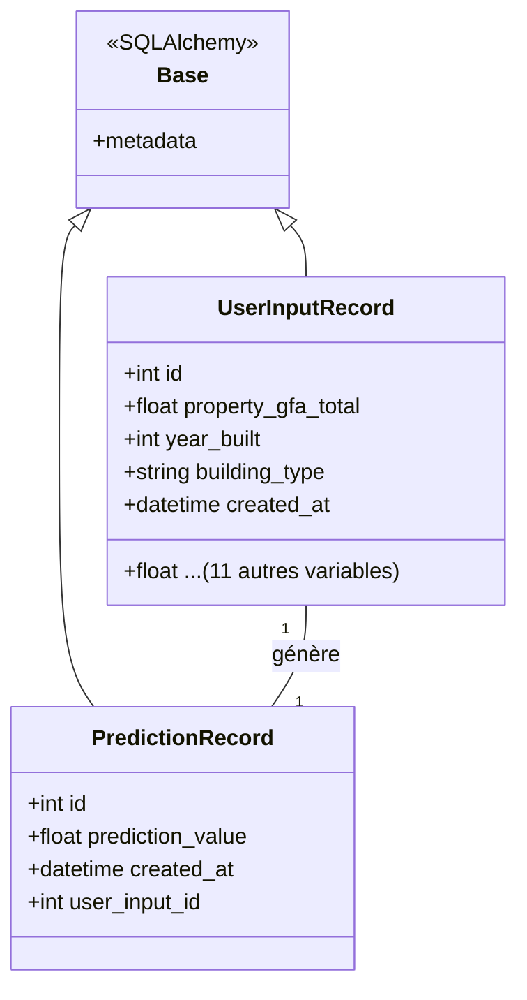

# Schéma de l'Architecture (UML simplifié)
-diagramme des classes :


-structure des flux :

Utilisateur ➔ saisit les données dans Gradio (UI)/doc.

UI ➔ envoie une requête JSON à FastAPI.

FastAPI ➔ valide les données avec Pydantic.

API ➔ appelle le Modèle (.joblib) pour le calcul.

API ➔ enregistre l'input + l'output dans PostgreSQL.

API ➔ renvoie le résultat à l'UI.

=== Diagramme des séquences/ des flux  === 
```mermaid
    autonumber
    actor User as Utilisateur (Gradio)
    participant API as FastAPI
    participant ML as Pipeline ML (14 vars)
    participant DB as PostgreSQL (Audit Log)

    User->>API: POST /predict (3 champs saisis)
    
    Note over API: Enrichissement des données :<br/>Passage de 3 à 14 variables
    
    API->>DB: crud.save_user_input (Entrée brute)
    
    API->>ML: model.predict (Vecteur complet)
    ML-->>API: Résultat (Empreinte Carbone)
    
    API->>DB: crud.create_prediction (Archivage résultat)
    DB-->>API: Confirmation
    
    API-->>User: Réponse JSON (Prédiction)
``` 
